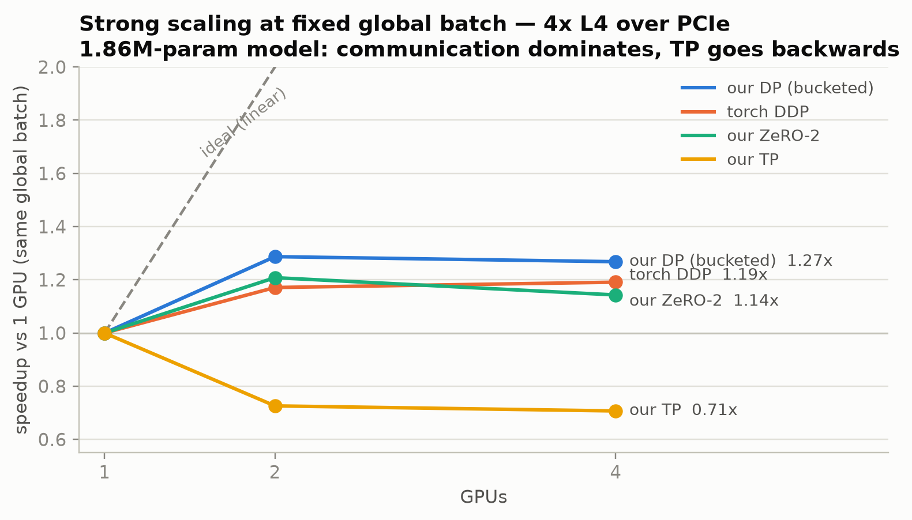
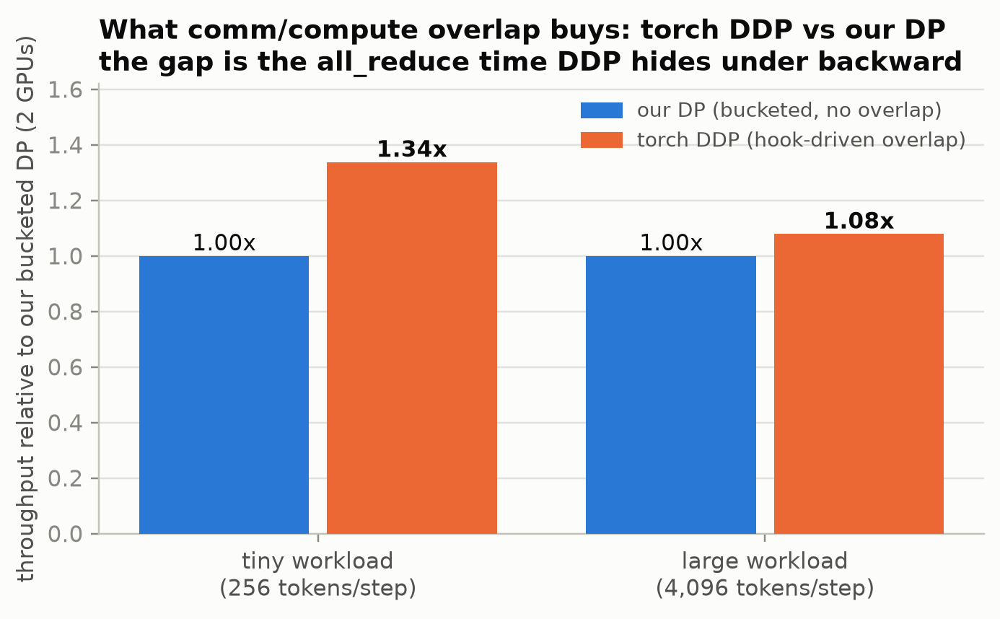
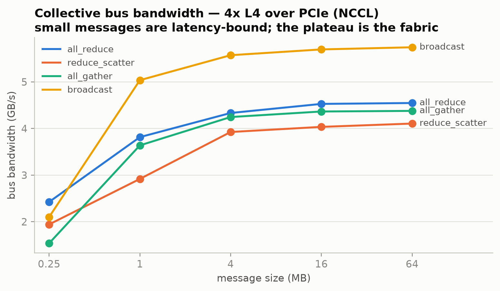

# minidist

Data parallelism, ZeRO-1/2 optimizer sharding, and tensor parallelism implemented from **raw `torch.distributed` collectives** — `all_reduce`, `reduce_scatter`, `all_gather`, `broadcast`. No `DistributedDataParallel`, no FSDP, no DeepSpeed in the core: every collective call is placed by hand, commented with why it exists and what breaks without it, and covered by a correctness gate. Torch's DDP and FSDP appear only as benchmark baselines to compare against.

The goal is to answer precisely: **what does each parallelism strategy communicate, when, and what does it cost?**

## What's implemented

| Component | Collectives used | File |
|---|---|---|
| Process harness | rendezvous, `all_reduce` smoke test | `src/minidist/launcher.py` |
| Data parallelism | rank-0 `broadcast` of params, `all_reduce(SUM)`+divide grad averaging, reverse-order **gradient bucketing** (one collective per flat bucket) | `src/minidist/parallel/dp.py` |
| ZeRO stage 1 | DP grad averaging + sharded AdamW over a flat partition, `all_gather` of updated params | `src/minidist/parallel/zero.py` |
| ZeRO stage 2 | `reduce_scatter` replaces the grad all_reduce — each rank only receives the gradient slice it owns | `src/minidist/parallel/zero.py` |
| Tensor parallelism | Megatron-style conjugate autograd functions (*f*: identity fwd / all_reduce bwd, *g*: all_reduce fwd / identity bwd), column/row-parallel linears, head-sharded attention | `src/minidist/parallel/tp.py` |

The model is deliberately tiny (1.86M-param, 2-layer decoder transformer on a synthetic Markov-chain LM task): the object of study is the communication, not the model. A tiny model on measured hardware is the regime where communication behavior is *most* visible.

## Correctness gates

Parallelism bugs are silent — a misplaced collective usually corrupts gradients without crashing. The test suite (28 gates, ~1 min on CPU) treats equivalence to single-process training as a provable property:

- **DP** must reproduce the single-process loss curve **per step** within a tolerance calibrated from the measured floating-point noise floor (~1.4e-6, reduction-order only), with gates orders of magnitude below the bug signal (>1e-2). A direct gate asserts all_reduced shard gradients equal single-process large-batch gradients, per parameter.
- **ZeRO-1 must match DP bitwise** (`==`, not allclose) — it runs DP's exact grad collectives and AdamW is elementwise, so nothing may differ. ZeRO-2 matches within reduce_scatter's summation-order noise. A byte-accounting gate proves per-rank optimizer state is `2 × 4 × ceil(N/world)` bytes — sharding that is real, not cosmetic.
- **TP** modules are gated in isolation against their unsharded references — forward *and* backward, including per-shard weight gradients — then end-to-end.
- A **negative control** runs DP without gradient sync and asserts the curves *diverge*: proof the matching gates can actually fail.

The same suite runs unchanged on GPU (`MINIDIST_DEVICE=cuda`); the gloo→NCCL migration is two config fields. All CPU-calibrated tolerances held on NCCL, including the ZeRO-1 bitwise gate.

## Results

Measured on 4× NVIDIA L4 (PCIe, no NVLink) and 2× T4, torch 2.13 / NCCL 2.29, single node. All numbers reproducible via one-command scripts that emit JSON (committed under `results/`).

### Strong scaling, fixed global batch (4× L4, 4096 tokens/step)



**How to read it:** each line is one strategy's throughput normalized to its own single-GPU run, with the same total work at every point (strong scaling). Ideal is the dashed diagonal — 2 GPUs = 2×. Every line bending flat at ~1.2–1.3× says the same thing: with only ~7.4MB of gradients to exchange but a ~4 GB/s PCIe ring to exchange them on, communication — not compute — sets the step time for a model this small. TP is the extreme case: it communicates *activations inside every forward and backward* (eight all_reduces per step at this depth), so adding GPUs makes it slower than one.

| mode | 1 GPU (tok/s) | 2 GPU | 4 GPU |
|---|---|---|---|
| DP (bucketed) | 398,560 | 513,135 (1.29×) | 505,330 (1.27×) |
| torch DDP | 472,608 | 553,603 (1.17×) | 562,877 (1.19×) |
| ZeRO-1 | 360,386 | 411,782 (1.14×) | 450,863 (1.25×) |
| **ZeRO-2** | **503,200** | **607,751 (1.21×)** | 575,240 (1.14×) |
| torch FSDP2 | 286,450 | 340,814 (1.19×) | 329,870 (1.15×) |
| TP | 444,319 | 322,446 (**0.73×**) | 314,279 (0.71×) |

The poor absolute scaling is the finding, not a failure: a 1.86M-param model exchanges a fixed ~7.4MB of gradients per step over a ~4 GB/s PCIe ring, so communication dominates — Amdahl's law measured from one's own collectives. Four results worth attention:

1. **The overlap gap, quantified.** DDP beats this repo's bucketed DP by ~8% on the compute-heavy workload and ~34% on the latency-bound one. The difference is exactly the optimization DDP has and this core (so far) does not: launching bucket all_reduces from backward hooks so communication hides under compute. The bucket structure here is built for it (reverse parameter order, persistent flat buffers) — it's the roadmap item with a pre-measured prize.

   

   The two workloads bracket the value of overlap: when a step is mostly communication (tiny), hiding the all_reduce is worth 34%; when compute grows (large), there's less comm *relative to* compute left to hide, and the same optimization is worth 8%. Overlap pays in proportion to how comm-bound you are.
2. **TP is *slower than one GPU* on PCIe (0.73×).** Each transformer block costs 2 forward + 2 backward activation all_reduces on the critical path — 8 × ~4MB per step at this size. First-party evidence for why Megatron confines TP to NVLink islands.
3. **ZeRO-2 is the fastest mode even on a single GPU.** Its sharded AdamW updates one flat contiguous tensor in a single elementwise pass, versus 38 per-tensor kernel launches for standard AdamW — the sharding design accidentally builds a fused optimizer.
4. **ZeRO's memory win has a crossover.** At 1.86M params, its fixed flat comm buffers outweigh the sharded-state savings (65MB peak vs 54MB for naive DP); the byte accounting proves the sharding while the totals show the win only appears when model size dwarfs the buffers.

### Collective microbenchmark (L4, busbw per nccl-tests convention)



**How to read it:** bus bandwidth normalizes each collective by its algorithmic traffic factor (ring all_reduce moves `2(n-1)/n` bytes per byte reduced), so every curve is directly comparable to the link's physical bandwidth. The steep left side is the latency-bound regime — a 0.25MB collective costs nearly the same wall time as a 4MB one, which is exactly why gradient *bucketing* (fewer, larger messages) exists. The plateau on the right is the PCIe fabric itself. At 64MB:

| op | 2 GPU | 4 GPU |
|---|---|---|
| all_reduce | 3.92 GB/s | 4.55 GB/s |
| reduce_scatter | 3.35 GB/s | 4.11 GB/s |
| all_gather | 3.22 GB/s | 4.38 GB/s |
| broadcast | 10.52 GB/s | 5.74 GB/s |

Ring bandwidth *rises* with participants (more links active in parallel) while broadcast falls — textbook ring-algorithm behavior, measured directly.

## Layout

```
src/minidist/
├── config.py        # frozen dataclasses; cpu/gloo -> cuda/nccl is two fields
├── launcher.py      # mp.spawn harness: rendezvous, per-rank logs, clean teardown
├── model.py         # tiny decoder transformer, shaped for the TP split
├── data.py          # synthetic Markov-chain LM; batches are a pure fn of (seed, step)
├── baseline.py      # single-process reference trainer (ground truth for all gates)
└── parallel/
    ├── dp.py        # manual DP + gradient bucketing
    ├── zero.py      # ZeRO-1/2 flat-sharded AdamW
    └── tp.py        # f/g pair, column/row-parallel linears, head-sharded attention
tests/               # the correctness gates (CPU by default, GPU via env)
scripts/             # one-command measurement: verify_gpu, bench_comm, bench_train, summarize
results/             # committed JSON from the measurement campaigns
```

## Running

```bash
uv venv && uv pip install -e . pytest    # or: pip install -e .[dev]
python -m pytest                          # 28 correctness gates, CPU, ~1 min
python -m minidist.smoke                  # 4-process gloo all_reduce smoke test
python -m minidist.parallel.dp            # DP vs baseline loss-curve comparison
```

On any multi-GPU box:

```bash
python scripts/verify_gpu.py                                   # same gates on NCCL
python scripts/bench_comm.py  --device cuda --world-size 4     # collective microbench
python scripts/bench_train.py --device cuda --world-size 4 --modes all
python scripts/summarize.py   --dir results                    # tables + summary.json
python scripts/plot_results.py --summary results/summary.json  # the README charts
```

With [Modal](https://modal.com) (how the committed results were produced — GPUs bill per second):

```bash
MINIDIST_GPU=L4:4 modal run scripts/modal_app.py --cmd "python scripts/verify_gpu.py"
```

## Design notes worth stealing

- **Collectives match by program order, nothing else.** There are no tags; the k-th collective on rank 0 pairs with the k-th on rank 3. Every layout decision (bucket assignment, ZeRO's flat partition) is therefore a pure function of parameter order and sizes, so ranks cannot disagree — disagreement is silent corruption, not a crash.
- **Averaging is `all_reduce(SUM)` + divide**, so the update equals the gradient of the mean loss over the global batch and the learning rate means the same thing at every world size (also: gloo has no AVG op; SUM+div ports to NCCL unchanged).
- **ZeRO partitions by flat offset, not by parameter** — slice boundaries cut tensors mid-run. Legal only because AdamW is purely elementwise; a norm-coupled optimizer (LAMB) could not be sharded this way without extra communication.
- **Row-parallel bias is added *after* the reduce** — inside it, the all_reduce would count the bias world_size times. The classic TP bug, structurally prevented.
- **Tolerances are measured, never guessed**: each gate documents the observed noise floor and the bug signal it must separate.
- **Data as a pure function of `(seed, step)`**: every rank materializes the identical global batch and slices its shard — "same data as the reference" holds by construction, with zero data communication.

## Roadmap

- Comm/compute overlap: launch bucket all_reduces from backward hooks on a side stream (structure in place; 8–34% measured headroom vs DDP).
- NVLink vs PCIe TP comparison on paired-3090 hardware.
- Vocab-parallel embedding + parallel cross-entropy (Megatron-style) to shard the LM head.
- ZeRO stage 3 (parameter sharding — communication inside forward).

## License

MIT
